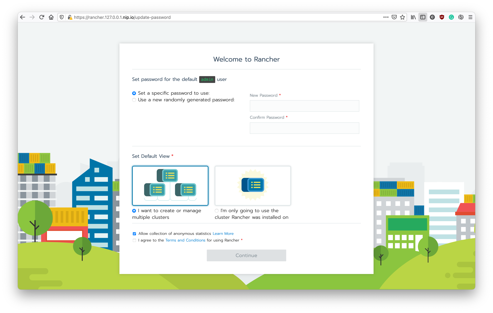
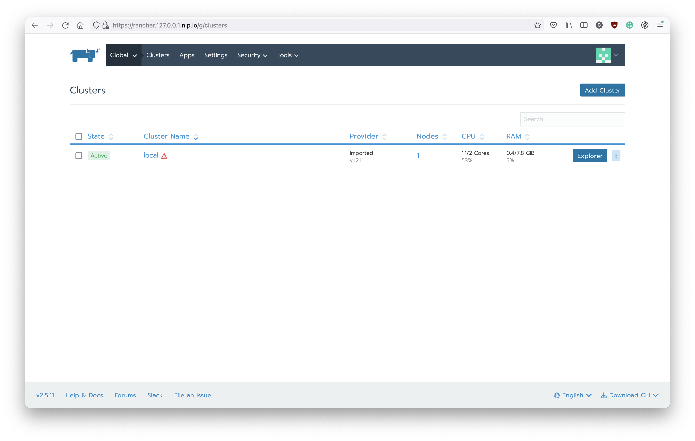

# Setup Kubernetes

Let's starting from setup the local kubernetes first.

## Kind

The `Kind`, means **Kubernetes IN Docker**. Is a tool for running local Kubernetes clusters using Docker container. This is a very convenience tool when you develop application on K8s.

To install the `Kind` CLI, please follow the instruction from its official doc:
https://kind.sigs.K8s.io/docs/user/quick-start/#installation

After you finish the installation, please use following command to create the K8s cluster at your local env:
```shell
#!/usr/bin/env bash

cat <<EOF | kind create cluster --wait 5m --config=-
kind: Cluster
apiVersion: kind.x-k8s.io/v1alpha4
containerdConfigPatches:
- |-
  [plugins."io.containerd.grpc.v1.cri".registry.mirrors."localhost:32000"]
    endpoint = ["http://localhost:32000"]
nodes:
- role: control-plane
  kubeadmConfigPatches:
  - |
    kind: InitConfiguration
    nodeRegistration:
      kubeletExtraArgs:
        node-labels: "ingress-ready=true"
  extraPortMappings:
  - containerPort: 80
    hostPort: 80
    protocol: TCP
  - containerPort: 443
    hostPort: 443
    protocol: TCP
  - containerPort: 32000
    hostPort: 32000
    protocol: TCP
EOF
```

This configuration will expose `80` and `443` port for the ingress and the `32000` for the `NodePort` usage.
After the kind cluster is ready, you can use the `kubectl` to access your local cluster.
```shell
kubectl get nodes
```

## Nginx Ingress

In the kubernetes, we will expose the service to the external network by using `NodePort` or `Ingress`. Usually, we only use the Ingress if your service is a HTTP based service.
There are many solution to use Ingress with your kubernetes. In this practice, we will use `Nginx Ingress`.

To install the Nginx Ingrss, we will use its helm chart. Here is the command to install the Nginx ingress with helm chart:
```shell
#!/usr/bin/env bash

helm repo add ingress-nginx https://kubernetes.github.io/ingress-nginx
helm repo update

helm upgrade --install ingress-nginx ingress-nginx/ingress-nginx \
    --namespace ingress-nginx \
    --create-namespace \
    --set controller.hostPort.enabled=true \
    --set controller.ingressClassResource.default=true \
    -f - << EOF
controller:
  hostPort:
    enabled: true
  ingressClassResource:
    default: true
  service:
    type: NodePort
  watchIngressWithoutClass: true
EOF

kubectl -n ingress-nginx rollout status deployment ingress-nginx-controller

```

Before you move to next step, we need to declare our domain name first. For the development purpose, using the [nip.io](https://nip.io/) is recommended. Please export the domain with `nip.io` like this:

```shell
export DOMAIN=127.0.0.1.nip.io
```

## Rancher

Now, let's introduce the `Rancher`. The `Rancher`, is a nice tool that can help you manage and operate your K8s cluster. To install Rancher, you will need to instal the `cert-manager` first. Here is the command to install `cert-manager` and `Rancher`. 

```shell
#!/usr/bin/env bash

# Install Cert-manager
helm repo add jetstack https://charts.jetstack.io
helm repo update

kubectl apply --validate=false -f https://github.com/jetstack/cert-manager/releases/download/v0.15.0/cert-manager.crds.yaml
helm upgrade --install cert-manager jetstack/cert-manager \
    --namespace cert-manager \
    --create-namespace \
    --version v0.15.0

kubectl -n cert-manager rollout status deployment cert-manager
sleep 30 # Prevent unexpected issue

# Install Rancher
helm repo add rancher-latest https://releases.rancher.com/server-charts/latest
helm repo update

helm upgrade --install rancher rancher-latest/rancher \
    --version v2.5.11 \
    --namespace cattle-system \
    --create-namespace \
    --set hostname=rancher.$DOMAIN \
    --set replicas=1

kubectl -n cattle-system rollout status deployment rancher

```

Since we declare the `$DOMAIN` as `127.0.0.1.nip.io`, we can use the URL https://rancher.127.0.0.1.nip.io to access the rancher on the local K8s cluster. It is exposed by the Nginx ingress with `nip.io` to use the subdomain. If you want to try it on the VM with AWS or GCP, you can replace it by the external IP of your VM.

After the installation is finished, you can access your rancher and see the screen:


Please set up the password of the `admin` user and continue with multipl cluster view.
Now, you can see the screen of clusters. Since we only install rancher with local cluster, so it will looks like this:


You can explore the `Rancher` and try to use it to operate your K8s cluster.

## Wrap Up

We finished the set up of K8s. You can use it as the playground to develop or learn the K8s. With the Rancher, you can use the UI to help you learn how to operate the K8s. It would be helpful if you spend some time to explore it. Now, let's move to the next step to learn how to deploy workloads to your K8s. 
