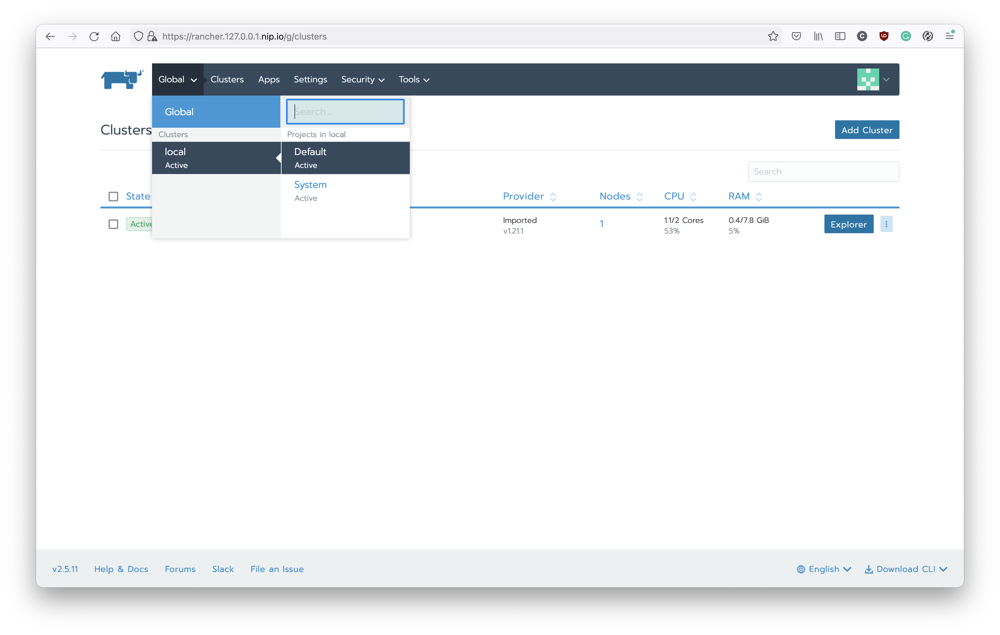
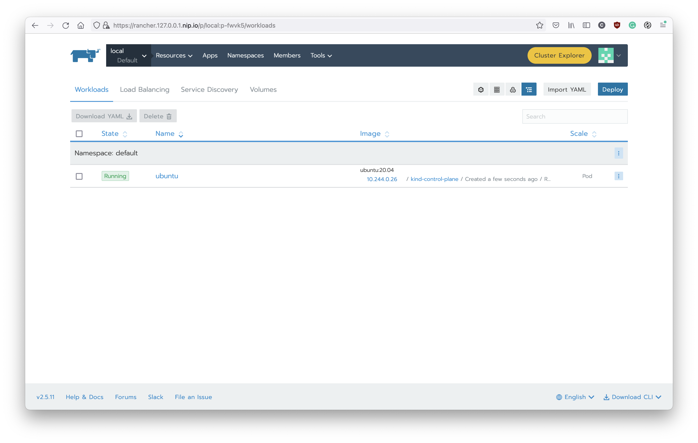
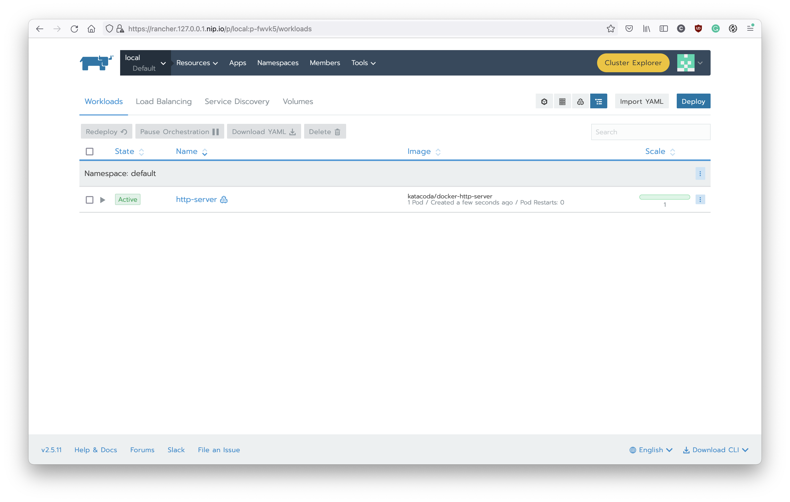
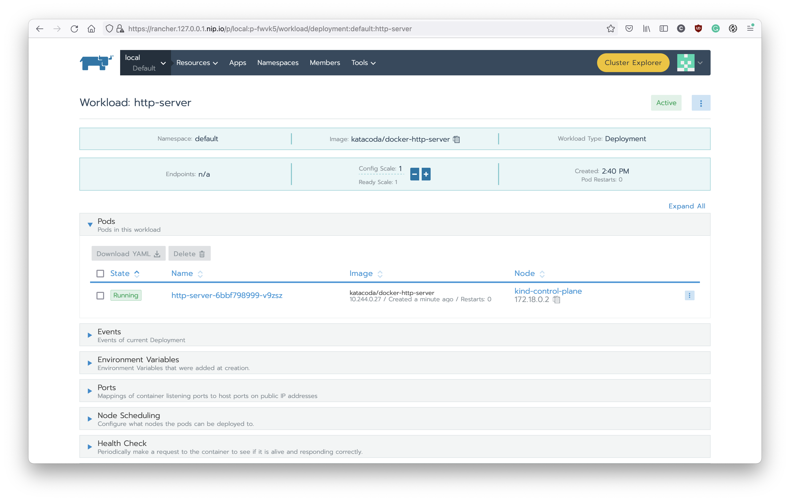
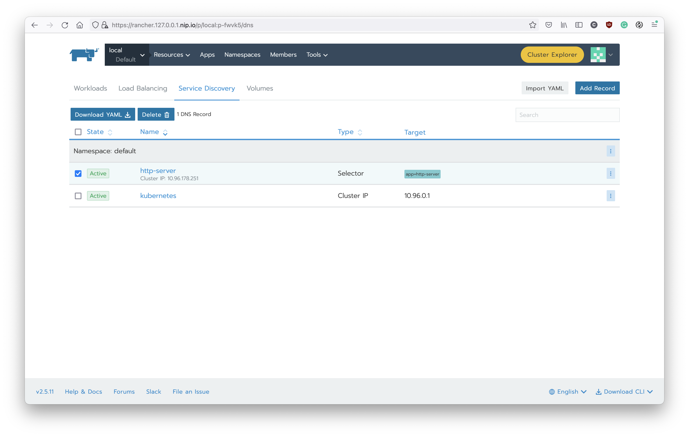
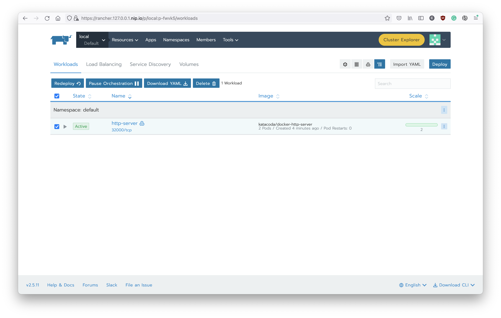
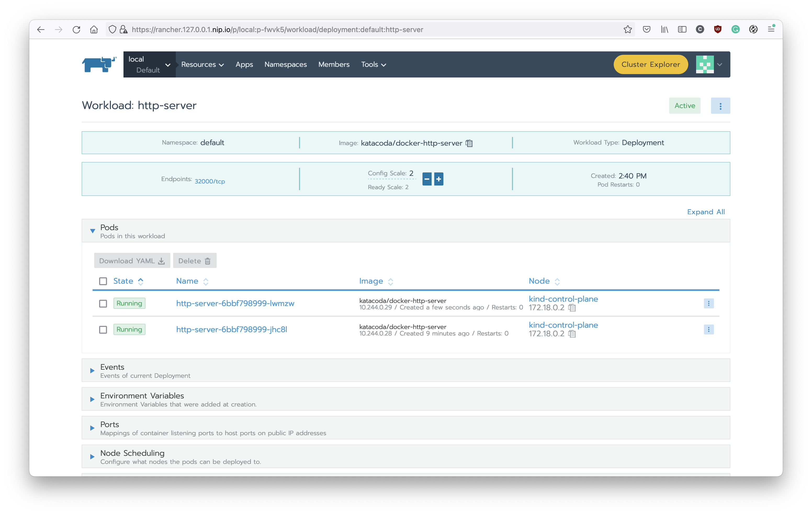
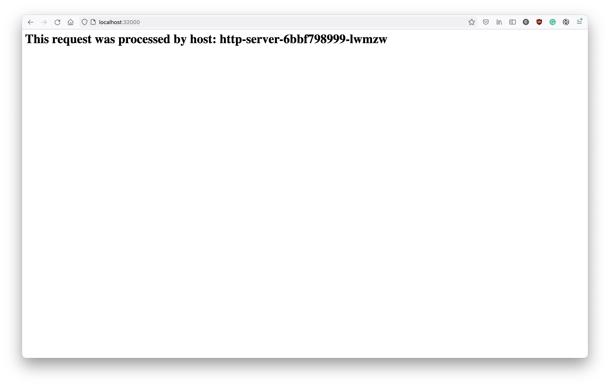
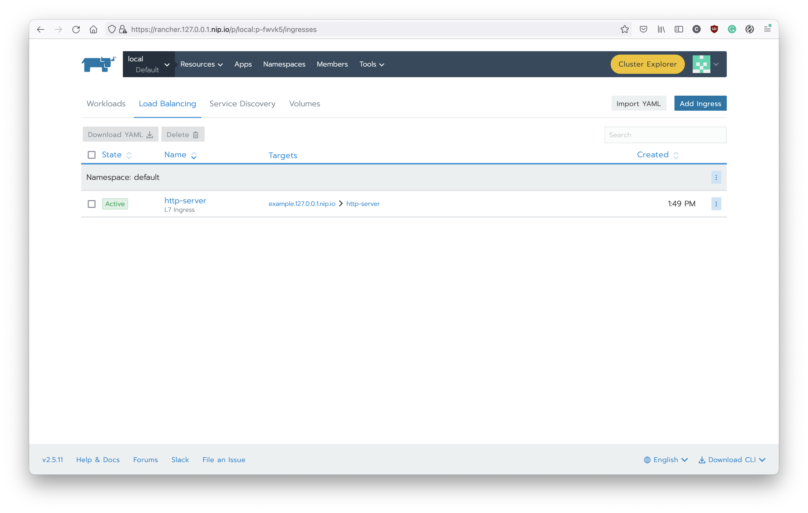

# Deploy Workloads

In the following examples, we will use a docker image which provided by [Katacoda](https://www.katacoda.com/) to deploy an example HTTP server.

## Pod

The **Pod** is the minimum component to run containers on Kubernetes. And when you need to scale containers on K8s (ex: Scale HTTP API to 10 instances), usually the target is Pod. Each pod contains at least one container but it also supports multiple containers in a Pod. We call those additional containers as **Sidecar** containers.

For example, you can run a container for your workload (ex: HTTP API, application) and write the logs to a local path in the container. Then, use the sidecar container to stream the logs from the local path to the log aggregator (ex: fluentd).

To create a Pod, you can use the command like:
```shell
# Without -n/--namespace, this pod will run in the default namespace
kubectl run -it ubuntu --image ubuntu:20.04
# You can operate with bash now.
# Let's exit the bash first, and use exec to enter pod again
exit
kubectl exec -it ubuntu -- bash
```

After you create the pod, you can also check the Rancher. You can found it under the deault project:


And the pod can be found under `Workloads` tab:


Before we move to next step, please delete this pod with:
```shell
kubectl delete pod ubuntu
```

## Deployment

You can create a Pod to run your workload on Kubernetes. However, when you need to scale it, you might need to create dozen of Pods. It could be a very tedious process if you do it manually.

So, there is another component **Deployment** to help you make this process more easily. The **Deployment**, which contains a template to create Pods (aka, Pod Template). And you can simply modify the number of replicas to scale your workload. But remember, it is suitable to run with a stateless workload (ex: RESTful API, if you implement with correct design). So, you can imagine that you have an HTTP API server. With Deployment, you can simply scale it to handle more incoming HTTP requests.

To better manage the Deployment, we usually use **YAML** to manage the configuration. Let's create the YAML file first:
```shell
cat << EOF > deployment.yaml
apiVersion: apps/v1
kind: Deployment
metadata:
  labels:
    app: http-server
  name: http-server
  namespace: default
spec:
  replicas: 1
  selector:
    matchLabels:
      app: http-server
  template:
    metadata:
      labels:
        app: http-server
    spec:
      containers:
      - image: katacoda/docker-http-server
        imagePullPolicy: Always
        name: http-server
        ports:
        - containerPort: 80
EOF
```

And then apply it to the K8s:
```shell
kubectl apply -f deployment.yaml
```

You can check with the CLI:
```shell
kubectl get deployment
```

Or with Rancher, there is a Deployment has been created:


And you can check the detail by click the link and see all the details like this:


There is only one pod in this deployment now. Let's try to scale it out and see what will happened on K8s. Click the `+` button and you can see there is a new pod has been created.


You can also check with `kubectl` to see there are two pods in the default namespace:
```shell
kubectl get pods
```

And you can apply the YAML again, it will make the number of pods to 1. Remember, the YAML file represents the desired state of your workload. It will change the state of K8s to fulfill your desired state.

If you want to delete the deployment, you can:
```shell
kubectl delete deployment http-server
# OR
kubectl delete -f deployment.yaml
```

Now, you might have a question, if we can have multiple instances of API server, how can we load balancing it? So, let’s talk about **Service**.

## Service

The **Service** is an abstract layer to help us forward the network traffic to a set of Pods (it could be Deployment). By default, it will forward the traffic to different Pods without any addtional configuration.

Usually, we will combine Deployment with Service, after scaling your workload by changing the number of replicas, you don’t have to worry about the load balance since the Kubernetes already provide Service to resolve this problem.

The K8s Service provides three different types to publish the service:

1. ClusterIP: Only provide internal IP in the cluster.

2. NodePort: Based on ClusterIP but Kubernetes will also expose the NodePort. The traffic to node external IP plus the NodePort will be forwarded to your workload if you use the NodePort type.

3. Load Balancer: Based on NodePort but plus the cloud provider’s support to allocate like AWS ELB to serving your workload.

Now, let's create a service:
```shell
cat << EOF > service.yaml
apiVersion: v1
kind: Service
metadata:
  labels:
    app: http-server
  name: http-server
  namespace: default
spec:
  clusterIP:
  ports:
  - name: default
    port: 80
    protocol: TCP
    targetPort: 80
  selector:
    app: http-server
  type: ClusterIP
EOF
```

And apply it:
```shell
kubectl apply -f service.yaml
```

And you can see there is a new service has been created on K8s. You can check it with Rancher in the `Service Discovery` tab:


Or the CLI:
```shell
kubectl get services
```

Since we use the service type `ClusterIP` now so we cannot access from out of K8s. Let's apply some change on it:
```shell
CLUSTER_IP=$(kubectl get service http-server -o jsonpath='{.spec.clusterIP}')
cat << EOF > service.yaml
apiVersion: v1
kind: Service
metadata:
  labels:
    app: http-server
  name: http-server
  namespace: default
spec:
  clusterIP: $CLUSTER_IP
  ports:
  - name: default
    port: 80
    protocol: TCP
    targetPort: 80
    nodePort: 32000
  selector:
    app: http-server
  type: NodePort
EOF
```

And apply it again, you can see the Rancher shows the port has been allocated with this service:


You can also found it on the `Workload` tab:


Now, let's access the HTTP service with this NodePort <http://localhost:32000>. You should get the response similar to this:


The response will display the pod name. So we can scale out the number of pods and you can see the K8s service will load balancing the traffic automatically.



As you can see, we have two pods and the service will load balancing the traffic to this two pods.

## Ingress

In the above example, we can use the **NodePort** to access the HTTP server on the K8s. However, exposing your workload to the outside world is still difficult. Using NodePort needs to expose `30000 - 32767` ports and it could be a serious security issue. On the other hand, using the Load Balancer needs support from cloud provider/Infrastructure so it might not be an ideal solution. So, we have the **Ingress** to resolve our problem.

The **Ingress**, is an abstract layer to help us manage reverse proxy. You can find different implementations for Ingress controllers like Nginx, Traefik, Kong, and other popular solutions. Using the ingress-nginx is a common and simple one. You can create ingress with subdomain and path. Then, the ingress controller will forward the traffic to your workload. You only need to create service with `type: ClusterIP` and don’t worry about other management issues. Furthermore, if you can have a wildcard FQDN, you can simply create multiple Ingresses to serve your micro-services without too much operation effort.

Let's revert the configuration of service first:
```shell
CLUSTER_IP=$(kubectl get service http-server -o jsonpath='{.spec.clusterIP}')
cat << EOF > service.yaml
apiVersion: v1
kind: Service
metadata:
  labels:
    app: http-server
  name: http-server
  namespace: default
spec:
  clusterIP: $CLUSTER_IP
  ports:
  - name: default
    port: 80
    protocol: TCP
    targetPort: 80
  selector:
    app: http-server
  type: ClusterIP
EOF
```

And apply it:
```shell
kubectl apply -f service.yaml
```

Now, let's create the ingress for this service:
```shell
cat << EOF >> ingress.yaml
apiVersion: extensions/v1beta1
kind: Ingress
metadata:
  labels:
    app: http-server
  name: http-server
  namespace: default
spec:
  rules:
  - host: example.127.0.0.1.nip.io
    http:
      paths:
      - backend:
          serviceName: http-server
          servicePort: 80
        pathType: ImplementationSpecific
EOF
```

And apply it:
```shell
kubectl apply -f ingress.yaml
```

You can check with CLI:
```shell
kubectl get ingress
```

Or using the Rancher, navigate to `Load Balancing` tab, you can see your ingress like this:


Now, you can access the URL <http://example.127.0.0.1.nip.io> to access the deployment with ingress and it should looks like:


## Wrap Up

In this example, you can learn how to deploy a HTTP server and expose it for external access. Besides, with the K8s deployment, you can also scale the HTTP server to multiple instances which can handle large workloads with minimum operation efforts. There still a lot of topics to optimize the configuration to make it production ready. We might have more example in the future.
